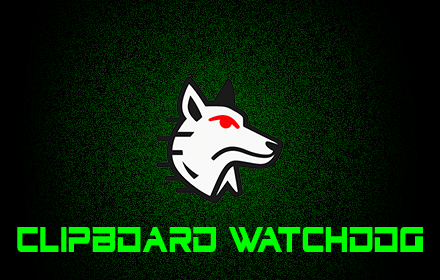
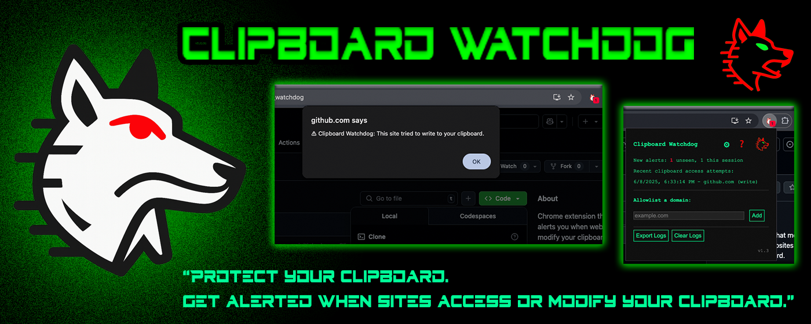

# Clipboard Watchdog

Clipboard Watchdog is a Chrome extension that monitors and alerts you when websites access or modify your clipboard. It helps protect your privacy by detecting suspicious clipboard activity, logging attempts, and providing user controls.

## 🐕 Install

**[Install from Chrome Web Store](https://chromewebstore.google.com/detail/clipboard-watchdog/lkigpidloeacbmmocpnppnjimlmfedif)**

## Features
- **Alerts** when a site tries to read, write, copy, cut, or paste your clipboard using JavaScript.
- **Logs** each attempt with site, action, result, and detection tags (background, no-gesture, overwrite-loop, exfiltration, etc.).
- **Exfiltration detection:** Flags when a clipboard read is quickly followed by a network request (fetch/XHR), which may indicate clipboard data exfiltration. **Note:** This does not guarantee clipboard data was sent—only that a suspicious pattern occurred.
- **Badge & Icon:** Shows a badge counter and flashes an alert icon for new or suspicious activity.
- **Allowlist:** Silence alerts/logs for trusted domains.
- **Export:** Download your logs as CSV or JSON.
- **Block all clipboard access:** Aggressively blocks all JavaScript clipboard access (toggle in settings).
- **Settings:** Customize popup alerts, badge counter, log auto-clear, export format, and blocking behavior.
- **Privacy-first:** All logs and settings stay on your device. No clipboard data is ever sent anywhere.

## Promo Images

**Small Promo Tile (440x280):**

**Marquee Promo Tile (1400x560):**

## Screenshots
1. **Popup UI (main view)**  
   
2. **Settings modal**  
   
3. **Alert: Write detected, badge shown**  
   
4. **Popup UI with new alert example**  
   
5. **Alert: Detected via legacy clipboard API**  
   
6. **Alert: No recent user gesture detected**  
   
7. **Alert: Exfiltration detected**  
   

## Privacy Policy
Clipboard Watchdog does **not** collect, store, or transmit your clipboard data or browsing activity. All logs and settings stay on your device. See [PRIVACY.md](./PRIVACY.md) for details.

## Support & Feedback
- [Install from Chrome Web Store](https://chromewebstore.google.com/detail/clipboard-watchdog/lkigpidloeacbmmocpnppnjimlmfedif)
- [Open an issue](https://github.com/ianheil/clipboard_watchdog/issues) on GitHub

## License
MIT 